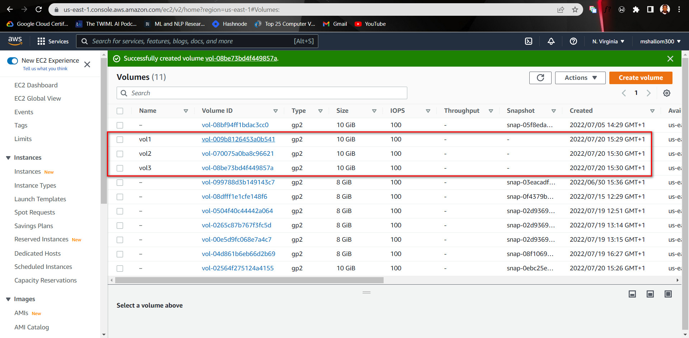
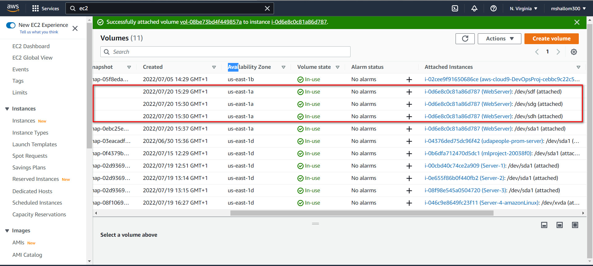
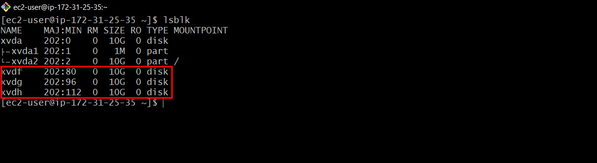
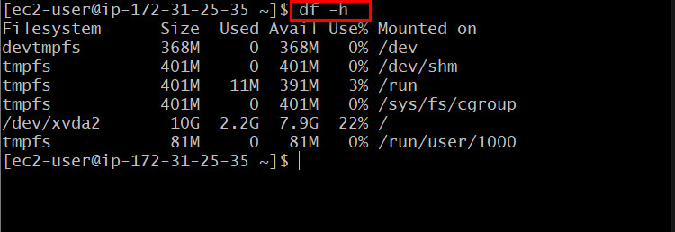
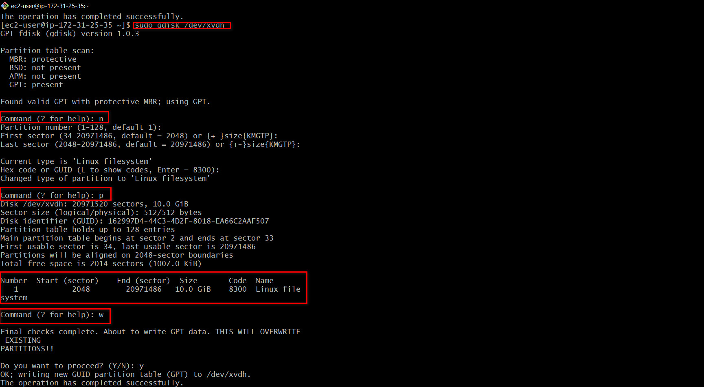
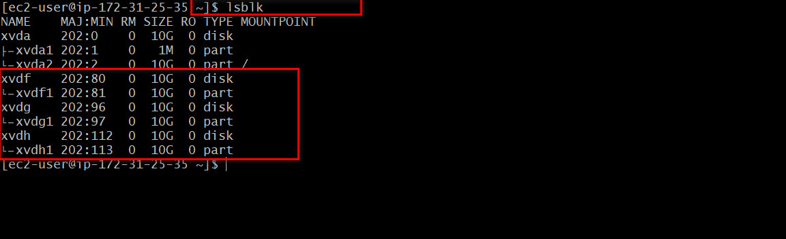

# Implementing-Wordpress-Web-Solution

## STEP1 Preparing Web Server

- Create a EC2 instance server on AWS 

- On the EBS console, create 3 storage volumes for the instance. This serves as additional external storage to our EC2 machine

- Attach the created volumes to the EC2 instance 

- SSH into the instance and on the EC2 terminal, view the disks attached to the instance. This is achieved using the `lsblk` command.

To see all mounts and free spaces on our server

Create single partitions on each volume on the server using `gdisk `

